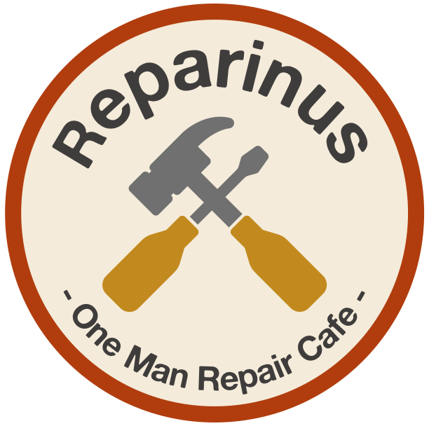

<html lang="en">
  <head>
    <meta charset="utf-8">
    <meta name="viewport" content="width=device-width, initial-scale=1">
    <meta name="color-scheme" content="light dark">
    <title>Preview • Pico CSS</title>
    <meta name="description" content="A pure HTML example, without dependencies.">
    <meta name="referer" content="strict-origin-when-cross-origin">
    <meta name="referrer" content="strict-origin-when-cross-origin">

    <!-- Pico.css -->
    <link
      rel="stylesheet"
      href="https://cdn.jsdelivr.net/npm/@picocss/pico@2/css/pico.min.css"
    >
    
  </head>

  <body>
    <!-- Header -->
    <header class="container">
                  <!-- Paste your SVG code here -->
            
    </header>
    <!-- ./ Header -->

    <!-- Main -->
    <main class="container">
      
      <!-- Typography-->
      <section id="typography">
        <h2>Welkom bij het One Man Repair Cafe Reparinus</h2>
        

          Hallo, ik ben Rinus en ik ben onlangs met Repair Cafe Reparinus gestart. De plek waar je spullen die je nog een tweede leven gunt, kosteloos kunt laten repareren.
        

        <h2>Hoe is Reparinus tot stand gekomen?</h2>
        

          Het valt mij op dat er heel erg veel spullen worden weggegooid omdat er iets kleins aan mankeert. Dagelijks kom ik ze op straat tegen, een stofzuiger waar een van de wieltjes niet meer wil meewerken, een ventilator die soms wel of soms niet aan wil gaan, of een videorecorder waar het snoer van beschadigd is. Het zijn allemaal afdankertjes waar verder ogenschijnlijk weinig mis mee is. Omdat ik graag wil voorkomen dat dit soort spullen onnodig op de afvalhoop belanden wil ik mij inzetten om te helpen met het repareren van spullen die misschien nog wel een heel tweede leven voor zich hebben.
        

        

          Al van kinds af aan haal ik alles wat ik in mijn handen krijg uit elkaar. Daardoor weet ik van veel apparaten hoe ze werken en in geval van schade, wat er eventueel aan gefixt kan worden. De laatste jaren repareer ik ook steeds meer apparaten voor anderen. Het is avontuurlijk en leerzaam, en soms is het een hele zoektocht om te ontdekken wat er precies stuk is aan een apparaat maar dat maakt het ook weer leuk detectivewerk. Helaas zijn veel apparaten tegenwoordig moeilijk te repareren en het is heel begrijpelijk dat veel mensen de moeite niet meer nemen om iets te repareren omdat er soms best wel een leercurve achter zit.
        

        <h2>Iedereen is welkom!</h2>
        

          Ik maak geen onderscheid tussen arm of rijk, iedereen is welkom en de service blijft gratis.
        

        

          Omdat dit op vrijwillige basis geschied, zitten er wel wat andere spelregels aan verbonden. Zo reserveer ik het recht om elk apparaat te weigeren zonder verdere uitleg, kan ik geen garantie bieden, en kan ik geen reparaties aanbieden waarbij vervangende onderdelen moeten worden besteld. Mocht er een vervangend onderdeel besteld worden, dan valt dit onder de verantwoordelijkheid van de rechtmatige eigenaar van het apparaat en zal dit in samenspraak geregeld moeten worden.
        

        <!-- Lists-->
        <h3>Zijn er voorbeelden van reparaties die je kunt uitvoeren?</h3>
        

          Jazeker, hier volgt een korte lijst met voorbeelden:
        

        <ul>
          <li>Het weer soepel laten rollen van wieltjes</li>
          <li>Draden weer aan elkaar solderen of een snoer vervangen</li>
          <li>Waar mogelijk gebroken of losgeraakte onderdelen namaken, weer vastlijmen, of weer terug bevestigen waar ze horen</li>
          <li>Repareren van contactjes van schakelaars of batterijhouders</li>
        </ul>
      </section>
      <section id="yt">
        <iframe width="560" height="315" src="https://www.youtube-nocookie.com/embed/JPzC_sbBfyY?si=1pfnkTdfOZ0-O6UU&amp;controls=0" title="YouTube video player" frameborder="0" allow="accelerometer; autoplay; clipboard-write; encrypted-media; gyroscope; picture-in-picture; web-share" referrerpolicy="strict-origin-when-cross-origin" allowfullscreen></iframe>
      </section>
      <section id="typography">
        <!-- Inline text elements-->
        <h3>Inline text elements</h3>
        

          
<a href="#" onclick="event.preventDefault()">Primary link</a>

          

            <a href="#" class="secondary" onclick="event.preventDefault()">Secondary link</a>
          

          

            <a href="#" class="contrast" onclick="event.preventDefault()">Contrast link</a>
          

        

        

          
<strong>Bold</strong>

          
<em>Italic</em>

          
<u>Underline</u>

        

        

          
<del>Deleted</del>

          
<ins>Inserted</ins>

          
<s>Strikethrough</s>

        

        

          
<small>Small </small>

          
Text Sub

          
Text Sup

        

        

          

            <abbr title="Abbreviation" data-tooltip="Abbreviation">Abbr.</abbr>
          

          
<kbd>Kbd</kbd>

          
<mark>Highlighted</mark>

        

        <!-- Headings-->
        <h3>Heading 3</h3>
        

          Integer bibendum malesuada libero vel eleifend. Fusce iaculis turpis ipsum, at efficitur
          sem scelerisque vel. Aliquam auctor diam ut purus cursus fringilla. Class aptent taciti
          sociosqu ad litora torquent per conubia nostra, per inceptos himenaeos.
        

        <h4>Heading 4</h4>
        

          Cras fermentum velit vitae auctor aliquet. Nunc non congue urna, at blandit nibh. Donec ac
          fermentum felis. Vivamus tincidunt arcu ut lacus hendrerit, eget mattis dui finibus.
        

        <h5>Heading 5</h5>
        

          Donec nec egestas nulla. Sed varius placerat felis eu suscipit. Mauris maximus ante in
          consequat luctus. Morbi euismod sagittis efficitur. Aenean non eros orci. Vivamus ut diam
          sem.
        

        <h6>Heading 6</h6>
        

          Ut sed quam non mauris placerat consequat vitae id risus. Vestibulum tincidunt nulla ut
          tortor posuere, vitae malesuada tortor molestie. Sed nec interdum dolor. Vestibulum id
          auctor nisi, a efficitur sem. Aliquam sollicitudin efficitur turpis, sollicitudin
          hendrerit ligula semper id. Nunc risus felis, egestas eu tristique eget, convallis in
          velit.
        

        <!-- Medias-->
        <figure>
          
          <figcaption>
            Image from
            <a href="https://unsplash.com/photos/a562ZEFKW8I" target="_blank">unsplash.com</a>
          </figcaption>
        </figure>
      </section>
      <!-- ./ Typography-->

      <!-- Buttons-->
      <section id="buttons">
        <h2>Buttons</h2>
        

          <button>Primary</button>
          <button class="secondary">Secondary</button>
          <button class="contrast">Contrast</button>
        

        

          <button class="outline">Primary outline</button>
          <button class="outline secondary">Secondary outline</button>
          <button class="outline contrast">Contrast outline</button>
        

      </section>
      <!-- ./ Buttons -->

      <!-- Form elements-->
      <section id="form">
        <form>
          <h2>Form elements</h2>

          <!-- Search -->
          <label for="search">Search</label>
          <input type="search" id="search" name="search" placeholder="Search">

          <!-- Text -->
          <label for="text">Text</label>
          <input type="text" id="text" name="text" placeholder="Text">
          <small>Curabitur consequat lacus at lacus porta finibus.</small>

          <!-- Select -->
          <label for="select">Select</label>
          <select id="select" name="select" required>
            <option value="" selected>Select…</option>
            <option>…</option>
          </select>

          <!-- File browser -->
          <label for="file"
            >File browser
            <input type="file" id="file" name="file">
          </label>

          <!-- Range slider control -->
          <label for="range"
            >Range slider
            <input type="range" min="0" max="100" value="50" id="range" name="range">
          </label>

          <!-- States -->
          

            <label for="valid">
              Valid
              <input type="text" id="valid" name="valid" placeholder="Valid" aria-invalid="false">
            </label>
            <label for="invalid">
              Invalid
              <input
                type="text"
                id="invalid"
                name="invalid"
                placeholder="Invalid"
                aria-invalid="true"
              >
            </label>
            <label for="disabled">
              Disabled
              <input type="text" id="disabled" name="disabled" placeholder="Disabled" disabled>
            </label>
          

          

            <!-- Date-->
            <label for="date"
              >Date
              <input type="date" id="date" name="date">
            </label>

            <!-- Time-->
            <label for="time"
              >Time
              <input type="time" id="time" name="time">
            </label>

            <!-- Color-->
            <label for="color"
              >Color
              <input type="color" id="color" name="color" value="#0eaaaa">
            </label>
          

          

            <!-- Checkboxes -->
            <fieldset>
              <legend><strong>Checkboxes</strong></legend>
              <label for="checkbox-1">
                <input type="checkbox" id="checkbox-1" name="checkbox-1" checked>
                Checkbox
              </label>
              <label for="checkbox-2">
                <input type="checkbox" id="checkbox-2" name="checkbox-2">
                Checkbox
              </label>
            </fieldset>

            <!-- Radio buttons -->
            <fieldset>
              <legend><strong>Radio buttons</strong></legend>
              <label for="radio-1">
                <input type="radio" id="radio-1" name="radio" value="radio-1" checked>
                Radio button
              </label>
              <label for="radio-2">
                <input type="radio" id="radio-2" name="radio" value="radio-2">
                Radio button
              </label>
            </fieldset>

            <!-- Switch -->
            <fieldset>
              <legend><strong>Switches</strong></legend>
              <label for="switch-1">
                <input type="checkbox" id="switch-1" name="switch-1" role="switch" checked>
                Switch
              </label>
              <label for="switch-2">
                <input type="checkbox" id="switch-2" name="switch-2" role="switch">
                Switch
              </label>
            </fieldset>
          

          <!-- Buttons -->
          <input type="reset" value="Reset" onclick="event.preventDefault()">
          <input type="submit" value="Submit" onclick="event.preventDefault()">
        </form>
      </section>
      <!-- ./ Form elements-->

      <!-- Tables -->
      <section id="tables">
        <h2>Tables</h2>
        

          <table class="striped">
            <thead>
              <tr>
                <th scope="col">#</th>
                <th scope="col">Heading</th>
                <th scope="col">Heading</th>
                <th scope="col">Heading</th>
                <th scope="col">Heading</th>
                <th scope="col">Heading</th>
                <th scope="col">Heading</th>
                <th scope="col">Heading</th>
              </tr>
            </thead>
            <tbody>
              <tr>
                <th scope="row">1</th>
                <td>Cell</td>
                <td>Cell</td>
                <td>Cell</td>
                <td>Cell</td>
                <td>Cell</td>
                <td>Cell</td>
                <td>Cell</td>
              </tr>
              <tr>
                <th scope="row">2</th>
                <td>Cell</td>
                <td>Cell</td>
                <td>Cell</td>
                <td>Cell</td>
                <td>Cell</td>
                <td>Cell</td>
                <td>Cell</td>
              </tr>
              <tr>
                <th scope="row">3</th>
                <td>Cell</td>
                <td>Cell</td>
                <td>Cell</td>
                <td>Cell</td>
                <td>Cell</td>
                <td>Cell</td>
                <td>Cell</td>
              </tr>
            </tbody>
          </table>
        

      </section>
      <!-- ./ Tables -->

      <!-- Modal -->
      <section id="modal">
        <h2>Modal</h2>
        <button class="contrast" data-target="modal-example" onclick="toggleModal(event)">
          Launch demo modal
        </button>
      </section>
      <!-- ./ Modal -->

      <!-- Accordions -->
      <section id="accordions">
        <h2>Accordions</h2>
        

          
Accordion 1

          

            Lorem ipsum dolor sit amet, consectetur adipiscing elit. Pellentesque urna diam,
            tincidunt nec porta sed, auctor id velit. Etiam venenatis nisl ut orci consequat, vitae
            tempus quam commodo. Nulla non mauris ipsum. Aliquam eu posuere orci. Nulla convallis
            lectus rutrum quam hendrerit, in facilisis elit sollicitudin. Mauris pulvinar pulvinar
            mi, dictum tristique elit auctor quis. Maecenas ac ipsum ultrices, porta turpis sit
            amet, congue turpis.
          

        

        

          
Accordion 2

          <ul>
            <li>Vestibulum id elit quis massa interdum sodales.</li>
            <li>Nunc quis eros vel odio pretium tincidunt nec quis neque.</li>
            <li>Quisque sed eros non eros ornare elementum.</li>
            <li>Cras sed libero aliquet, porta dolor quis, dapibus ipsum.</li>
          </ul>
        

      </section>
      <!-- ./ Accordions -->

      <!-- Article-->
      <article id="article">
        <h2>Article</h2>
        

          Nullam dui arcu, malesuada et sodales eu, efficitur vitae dolor. Sed ultricies dolor non
          ante vulputate hendrerit. Vivamus sit amet suscipit sapien. Nulla iaculis eros a elit
          pharetra egestas. Nunc placerat facilisis cursus. Sed vestibulum metus eget dolor pharetra
          rutrum.
        

        <footer>
          <small>Duis nec elit placerat, suscipit nibh quis, finibus neque.</small>
        </footer>
      </article>
      <!-- ./ Article-->

      <!-- Group -->
      <section id="group">
        <h2>Group</h2>
        <form>
          <fieldset role="group">
            <input name="email" type="email" placeholder="Enter your email" autocomplete="email">
            <input type="submit" value="Subscribe">
          </fieldset>
        </form>
      </section>
      <!-- ./ Group -->

      <!-- Progress -->
      <section id="progress">
        <h2>Progress bar</h2>
        <progress id="progress-1" value="25" max="100"></progress>
        <progress id="progress-2"></progress>
      </section>
      <!-- ./ Progress -->

      <!-- Loading -->
      <section id="loading">
        <h2>Loading</h2>
        <article aria-busy="true"></article>
        <button aria-busy="true">Please wait…</button>
      </section>
      <!-- ./ Loading -->
    </main>
    <!-- ./ Main -->

    <!-- Footer -->
    <footer class="container">
      <small
        >Built with <a href="https://picocss.com">Pico</a> •
        <a href="https://github.com/picocss/examples/blob/master/v2-html/index.html"
          >Source code</a
        ></small
      >
    </footer>
    <!-- ./ Footer -->

    <!-- Modal example -->
    <dialog id="modal-example">
      <article>
        <header>
          <button
            aria-label="Close"
            rel="prev"
            data-target="modal-example"
            onclick="toggleModal(event)"
          ></button>
          <h3>Confirm your action!</h3>
        </header>
        

          Cras sit amet maximus risus. Pellentesque sodales odio sit amet augue finibus
          pellentesque. Nullam finibus risus non semper euismod.
        

        <footer>
          <button
            role="button"
            class="secondary"
            data-target="modal-example"
            onclick="toggleModal(event)"
          >
            Cancel</button
          ><button autofocus data-target="modal-example" onclick="toggleModal(event)">
            Confirm
          </button>
        </footer>
      </article>
    </dialog>
    <!-- ./ Modal example -->

    <!-- Minimal theme switcher -->
    

    <!-- Modal -->
    
  </body>
</html>
